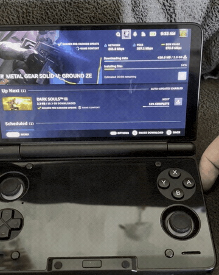
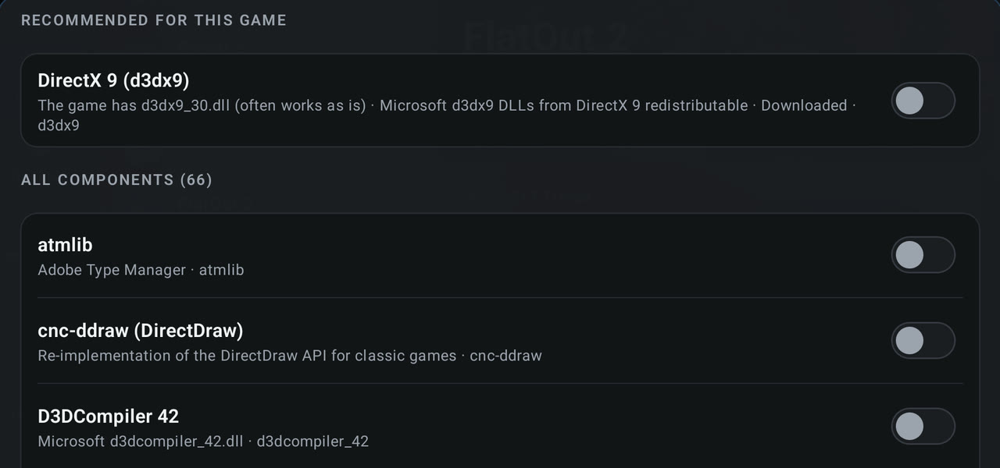

# DroidDeck 0.3.2

### Features

- Added **Keep downloads running** toggle, so Steam downloads can continue when Android sleeps. (@jmarti326, @xXJSONDeruloXx, [#335](https://github.com/Droid-Deck/DroidDeck/pull/335))

  

- Added **Native Steam sleep** with dynamic cloud save and wake movie support. (@xXJSONDeruloXx, [#291](https://github.com/Droid-Deck/DroidDeck/pull/291))

  

- Added **Adreno 6xx support**, including Adreno 650 (eg: Retroid Pocket 5). (@unbelievableflavour, @jmarti326, [#320](https://github.com/Droid-Deck/DroidDeck/pull/320), [#326](https://github.com/Droid-Deck/DroidDeck/pull/326))
- SD cards and external drives can now be used as full **Steam libraries**. (@maxjivi05, [#388](https://github.com/Droid-Deck/DroidDeck/pull/388))
- Added per-game **Windows components** with automatic dependency recommendations for Steam and non Steam games. (@The412Banner, [#287](https://github.com/Droid-Deck/DroidDeck/pull/287))

  

- Added XNA, PhysX, Games for Windows Live, MSXML and other Windows components without needing to run their original installers. (@The412Banner, [#347](https://github.com/Droid-Deck/DroidDeck/pull/347))
- Added optional **Force SSBS** for ARM64 Proton games on supported CPUs. (@The412Banner, [#328](https://github.com/Droid-Deck/DroidDeck/pull/328))
- Added a detailed **device report** with SoC, GPU, CPU, Vulkan, memory and driver information. (@The412Banner, [#295](https://github.com/Droid-Deck/DroidDeck/pull/295))
- Added **App scale** presets from 75% to 150%. (@xXJSONDeruloXx, [#272](https://github.com/Droid-Deck/DroidDeck/pull/272))
- File Manager can now browse DroidDeck’s Linux filesystem directly. (@The412Banner, [#392](https://github.com/Droid-Deck/DroidDeck/pull/392))
- Added a **Language** setting, with Steam automatically following the selected language. (@maxjivi05, [#284](https://github.com/Droid-Deck/DroidDeck/pull/284))
- Added opt-in **Debugging tools** for automated game/session control, input, UI inspection and repeatable test scenarios. (@xXJSONDeruloXx, [#406](https://github.com/Droid-Deck/DroidDeck/pull/406))

### Improvements

- Steam and games now run on separate Xwayland servers, closer to SteamOS behavior. (@xXJSONDeruloXx, [#344](https://github.com/Droid-Deck/DroidDeck/pull/344))
- DirectAudio is now the default on fresh installs, with major crackling and underrun improvements across both audio modes. (@maxjivi05, [#338](https://github.com/Droid-Deck/DroidDeck/pull/338))
- Steam now preserves edits made to added-game shortcuts, including Target, Start In, name and launch options. (@maxjivi05, [#393](https://github.com/Droid-Deck/DroidDeck/pull/393))
- Steam now uses the full session resolution on displays wider or larger than 1080p. (@xXJSONDeruloXx, [#391](https://github.com/Droid-Deck/DroidDeck/pull/391))
- Improved Snapdragon and Adreno detection on devices with incomplete hardware information. (@The412Banner, [#295](https://github.com/Droid-Deck/DroidDeck/pull/295))
- Improved layouts for small screens and longer translated text. (@xXJSONDeruloXx, @maxjivi05, [#268](https://github.com/Droid-Deck/DroidDeck/pull/268), [#284](https://github.com/Droid-Deck/DroidDeck/pull/284))
- File Manager and file pickers can now navigate upward from game folders, prefixes and remembered locations. (@The412Banner, [#377](https://github.com/Droid-Deck/DroidDeck/pull/377))
- Expanded and polished Spanish, Japanese, Korean, Chinese, French and Russian translations. (@maxjivi05, @starwishHi, @zeedif, @Tak-attack, @kmnkv1, [#284](https://github.com/Droid-Deck/DroidDeck/pull/284), [#286](https://github.com/Droid-Deck/DroidDeck/pull/286), [#234](https://github.com/Droid-Deck/DroidDeck/pull/234), [#314](https://github.com/Droid-Deck/DroidDeck/pull/314), [#324](https://github.com/Droid-Deck/DroidDeck/pull/324))
- Steam and Linux apps now use Android’s system fonts for Chinese, Japanese, Korean, Thai and other missing characters. (@maxjivi05, @0x1428571429, [#374](https://github.com/Droid-Deck/DroidDeck/pull/374), [#252](https://github.com/Droid-Deck/DroidDeck/pull/252))
- Sessions launched from Android frontends now return to that frontend when they close. (@xXJSONDeruloXx, [#300](https://github.com/Droid-Deck/DroidDeck/pull/300))

### Fixed

- Fixed MangoHud reporting roughly double the real battery power draw and incorrect remaining time. (Thanks Russ ❤️)(@xXJSONDeruloXx, [#270](https://github.com/Droid-Deck/DroidDeck/pull/270))
- Fixed slow Steam installs on SD cards and external storage, including long **Reserving space** / **Committing** stages and installs failing to begin. (@maxjivi05, [#388](https://github.com/Droid-Deck/DroidDeck/pull/388), [#410](https://github.com/Droid-Deck/DroidDeck/pull/410))
- Fixed some games staying behind Steam’s black** **loading screen while already running. (@xXJSONDeruloXx, [#401](https://github.com/Droid-Deck/DroidDeck/pull/401))
- Fixed a graphics-memory leak that could kill the session. (@The412Banner, @xXJSONDeruloXx, [#275](https://github.com/Droid-Deck/DroidDeck/pull/275), [#305](https://github.com/Droid-Deck/DroidDeck/pull/305))
- Fixed some added games starting in `C:\windows` instead of their own game folder. (@The412Banner, [#343](https://github.com/Droid-Deck/DroidDeck/pull/343))
- Fixed Firefox and LibreWolf tabs crashing on affected **Android 16** devices. (@The412Banner, [#280](https://github.com/Droid-Deck/DroidDeck/pull/280))
- Fixed resolution presets changing the screen shape, and fixed 16:9 stretch in Steam Deck mode. (@xXJSONDeruloXx, @magarto, [#337](https://github.com/Droid-Deck/DroidDeck/pull/337), [#133](https://github.com/Droid-Deck/DroidDeck/pull/133))
- Fixed several Steam sleep and wake edge cases. (@xXJSONDeruloXx, [#289](https://github.com/Droid-Deck/DroidDeck/pull/289))
- Fixed some new sessions starting with the wrong output size. (@xXJSONDeruloXx, [#357](https://github.com/Droid-Deck/DroidDeck/pull/357))
- Fixed Windows component installation failures and improved controller navigation in the component picker. (@The412Banner, [#347](https://github.com/Droid-Deck/DroidDeck/pull/347))
- Removed the old **Force game windows fullscreen** workaround now that games run on their own Xwayland server. (@xXJSONDeruloXx, [#349](https://github.com/Droid-Deck/DroidDeck/pull/349))
- Hardened the developer environment override so other apps with storage access cannot modify Steam session environment variables. (@The412Banner, [#413](https://github.com/Droid-Deck/DroidDeck/pull/413))

### New contributors

- @unbelievableflavour made their first contribution in [#320](https://github.com/Droid-Deck/DroidDeck/pull/320).
- @Lightfallingonionroom made their first contribution in [#232](https://github.com/Droid-Deck/DroidDeck/pull/232).
- @0x1428571429 made their first contribution in [#252](https://github.com/Droid-Deck/DroidDeck/pull/252).
- @zeedif made their first contribution in [#234](https://github.com/Droid-Deck/DroidDeck/pull/234).
- @Tak-attack made their first contribution in [#314](https://github.com/Droid-Deck/DroidDeck/pull/314).
- @kmnkv1 made their first contribution in [#324](https://github.com/Droid-Deck/DroidDeck/pull/324).

[Full changelog](https://github.com/Droid-Deck/DroidDeck/compare/0.3.1...0.3.2)
